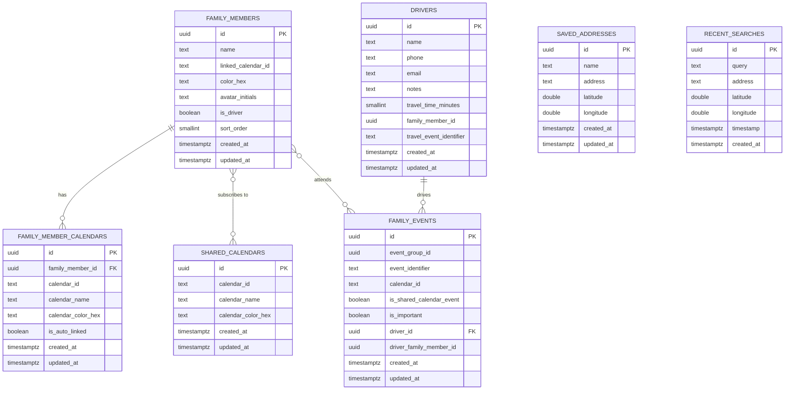

# FamCal Database Schema - Supabase Migration Guide

## Overview

This document provides a complete mapping of the FamCal Core Data model to a Supabase PostgreSQL database schema. The current local Core Data model contains **8 entities** that need to be migrated.

---

## Database Entities

### 1. FamilyMember

**Description**: Stores information about family members in the app.

| Field Name | Data Type | Nullable | Default | Description |
|------------|-----------|----------|---------|-------------|
| `id` | UUID | No | `gen_random_uuid()` | Primary key |
| `name` | TEXT | Yes | NULL | Family member's name |
| `linked_calendar_id` | TEXT | Yes | NULL | iOS Calendar ID linked to this member |
| `color_hex` | TEXT | Yes | NULL | Hex color code for UI representation |
| `avatar_initials` | TEXT | Yes | NULL | Initials for avatar display |
| `is_driver` | BOOLEAN | No | FALSE | Whether this member is a driver |
| `sort_order` | SMALLINT | No | 0 | Display order in lists |
| `created_at` | TIMESTAMPTZ | No | `now()` | Record creation timestamp |
| `updated_at` | TIMESTAMPTZ | No | `now()` | Record update timestamp |

**Relationships**:
- One-to-many with `family_member_calendars`
- Many-to-many with `shared_calendars` (via junction table)
- Many-to-many with `family_events` (via junction table)

---

### 2. FamilyMemberCalendar

**Description**: Links family members to their personal iOS calendars.

| Field Name | Data Type | Nullable | Default | Description |
|------------|-----------|----------|---------|-------------|
| `id` | UUID | No | `gen_random_uuid()` | Primary key |
| `family_member_id` | UUID | Yes | NULL | Foreign key to `family_members` |
| `calendar_id` | TEXT | Yes | NULL | iOS Calendar identifier |
| `calendar_name` | TEXT | Yes | NULL | Display name of the calendar |
| `calendar_color_hex` | TEXT | Yes | NULL | Calendar color in hex format |
| `is_auto_linked` | BOOLEAN | No | FALSE | Whether calendar was automatically linked |
| `created_at` | TIMESTAMPTZ | No | `now()` | Record creation timestamp |
| `updated_at` | TIMESTAMPTZ | No | `now()` | Record update timestamp |

**Relationships**:
- Many-to-one with `family_members`

---

### 3. SharedCalendar

**Description**: Calendars that are shared among multiple family members.

| Field Name | Data Type | Nullable | Default | Description |
|------------|-----------|----------|---------|-------------|
| `id` | UUID | No | `gen_random_uuid()` | Primary key |
| `calendar_id` | TEXT | Yes | NULL | iOS Calendar identifier |
| `calendar_name` | TEXT | Yes | NULL | Display name of the shared calendar |
| `calendar_color_hex` | TEXT | Yes | NULL | Calendar color in hex format |
| `created_at` | TIMESTAMPTZ | No | `now()` | Record creation timestamp |
| `updated_at` | TIMESTAMPTZ | No | `now()` | Record update timestamp |

**Relationships**:
- Many-to-many with `family_members` (via junction table)

---

### 4. FamilyEvent

**Description**: Events associated with family members, including metadata about drivers and importance.

| Field Name | Data Type | Nullable | Default | Description |
|------------|-----------|----------|---------|-------------|
| `id` | UUID | No | `gen_random_uuid()` | Primary key |
| `event_group_id` | UUID | Yes | NULL | Groups related events together |
| `event_identifier` | TEXT | Yes | NULL | iOS Calendar event identifier |
| `calendar_id` | TEXT | Yes | NULL | iOS Calendar identifier |
| `is_shared_calendar_event` | BOOLEAN | No | FALSE | Whether event is from a shared calendar |
| `is_important` | BOOLEAN | No | FALSE | Whether event is marked as important |
| `driver_id` | UUID | Yes | NULL | Foreign key to `drivers` |
| `driver_family_member_id` | UUID | Yes | NULL | Family member ID who is the driver |
| `created_at` | TIMESTAMPTZ | No | `now()` | Record creation timestamp |
| `updated_at` | TIMESTAMPTZ | No | `now()` | Record update timestamp |

**Relationships**:
- Many-to-many with `family_members` (via junction table for attendees)
- Many-to-one with `drivers`

---

### 5. Driver

**Description**: Driver information for events requiring transportation.

| Field Name | Data Type | Nullable | Default | Description |
|------------|-----------|----------|---------|-------------|
| `id` | UUID | No | `gen_random_uuid()` | Primary key |
| `name` | TEXT | Yes | NULL | Driver's name |
| `phone` | TEXT | Yes | NULL | Driver's phone number |
| `email` | TEXT | Yes | NULL | Driver's email address |
| `notes` | TEXT | Yes | NULL | Additional notes about the driver |
| `travel_time_minutes` | SMALLINT | No | 0 | Default travel time in minutes |
| `family_member_id` | UUID | Yes | NULL | Associated family member ID |
| `travel_event_identifier` | TEXT | Yes | NULL | iOS Calendar identifier for travel event |
| `created_at` | TIMESTAMPTZ | No | `now()` | Record creation timestamp |
| `updated_at` | TIMESTAMPTZ | No | `now()` | Record update timestamp |

**Relationships**:
- One-to-many with `family_events`

---

### 6. SavedAddress

**Description**: User-saved addresses for quick event location selection.

| Field Name | Data Type | Nullable | Default | Description |
|------------|-----------|----------|---------|-------------|
| `id` | UUID | No | `gen_random_uuid()` | Primary key |
| `name` | TEXT | Yes | NULL | User-friendly name for the address |
| `address` | TEXT | Yes | NULL | Full address string |
| `latitude` | DOUBLE PRECISION | No | 0.0 | Latitude coordinate |
| `longitude` | DOUBLE PRECISION | No | 0.0 | Longitude coordinate |
| `created_at` | TIMESTAMPTZ | No | `now()` | Record creation timestamp |
| `updated_at` | TIMESTAMPTZ | No | `now()` | Record update timestamp |

---

### 7. RecentSearch

**Description**: Recent location searches for quick access.

| Field Name | Data Type | Nullable | Default | Description |
|------------|-----------|----------|---------|-------------|
| `id` | UUID | No | `gen_random_uuid()` | Primary key |
| `query` | TEXT | Yes | NULL | Search query text |
| `address` | TEXT | Yes | NULL | Resolved address from search |
| `latitude` | DOUBLE PRECISION | No | 0.0 | Latitude coordinate |
| `longitude` | DOUBLE PRECISION | No | 0.0 | Longitude coordinate |
| `timestamp` | TIMESTAMPTZ | Yes | NULL | When the search was performed |
| `created_at` | TIMESTAMPTZ | No | `now()` | Record creation timestamp |

---

### 8. Item (Legacy)

**Description**: Legacy entity from Core Data template (can be removed if not used).

| Field Name | Data Type | Nullable | Default | Description |
|------------|-----------|----------|---------|-------------|
| `id` | UUID | No | `gen_random_uuid()` | Primary key |
| `timestamp` | TIMESTAMPTZ | Yes | NULL | Timestamp field |

> [!NOTE]
> This entity appears to be from the Core Data template and may not be actively used in your app. Consider removing it during migration.

---

## Junction Tables (Many-to-Many Relationships)

### family_member_shared_calendars

Links family members to shared calendars.

| Field Name | Data Type | Nullable | Description |
|------------|-----------|----------|-------------|
| `family_member_id` | UUID | No | Foreign key to `family_members` |
| `shared_calendar_id` | UUID | No | Foreign key to `shared_calendars` |
| `created_at` | TIMESTAMPTZ | No | Record creation timestamp |

**Primary Key**: Composite (`family_member_id`, `shared_calendar_id`)

---

### family_event_attendees

Links family events to attending family members.

| Field Name | Data Type | Nullable | Description |
|------------|-----------|----------|-------------|
| `family_event_id` | UUID | No | Foreign key to `family_events` |
| `family_member_id` | UUID | No | Foreign key to `family_members` |
| `created_at` | TIMESTAMPTZ | No | Record creation timestamp |

**Primary Key**: Composite (`family_event_id`, `family_member_id`)

---

## SQL Migration Scripts

### Create Tables

```sql
-- Enable UUID extension
CREATE EXTENSION IF NOT EXISTS "uuid-ossp";

-- 1. Family Members
CREATE TABLE family_members (
    id UUID PRIMARY KEY DEFAULT gen_random_uuid(),
    name TEXT,
    linked_calendar_id TEXT,
    color_hex TEXT,
    avatar_initials TEXT,
    is_driver BOOLEAN NOT NULL DEFAULT FALSE,
    sort_order SMALLINT NOT NULL DEFAULT 0,
    created_at TIMESTAMPTZ NOT NULL DEFAULT now(),
    updated_at TIMESTAMPTZ NOT NULL DEFAULT now()
);

-- 2. Family Member Calendars
CREATE TABLE family_member_calendars (
    id UUID PRIMARY KEY DEFAULT gen_random_uuid(),
    family_member_id UUID REFERENCES family_members(id) ON DELETE CASCADE,
    calendar_id TEXT,
    calendar_name TEXT,
    calendar_color_hex TEXT,
    is_auto_linked BOOLEAN NOT NULL DEFAULT FALSE,
    created_at TIMESTAMPTZ NOT NULL DEFAULT now(),
    updated_at TIMESTAMPTZ NOT NULL DEFAULT now()
);

-- 3. Shared Calendars
CREATE TABLE shared_calendars (
    id UUID PRIMARY KEY DEFAULT gen_random_uuid(),
    calendar_id TEXT,
    calendar_name TEXT,
    calendar_color_hex TEXT,
    created_at TIMESTAMPTZ NOT NULL DEFAULT now(),
    updated_at TIMESTAMPTZ NOT NULL DEFAULT now()
);

-- 4. Drivers
CREATE TABLE drivers (
    id UUID PRIMARY KEY DEFAULT gen_random_uuid(),
    name TEXT,
    phone TEXT,
    email TEXT,
    notes TEXT,
    travel_time_minutes SMALLINT NOT NULL DEFAULT 0,
    family_member_id UUID,
    travel_event_identifier TEXT,
    created_at TIMESTAMPTZ NOT NULL DEFAULT now(),
    updated_at TIMESTAMPTZ NOT NULL DEFAULT now()
);

-- 5. Family Events
CREATE TABLE family_events (
    id UUID PRIMARY KEY DEFAULT gen_random_uuid(),
    event_group_id UUID,
    event_identifier TEXT,
    calendar_id TEXT,
    is_shared_calendar_event BOOLEAN NOT NULL DEFAULT FALSE,
    is_important BOOLEAN NOT NULL DEFAULT FALSE,
    driver_id UUID REFERENCES drivers(id) ON DELETE SET NULL,
    driver_family_member_id UUID,
    created_at TIMESTAMPTZ NOT NULL DEFAULT now(),
    updated_at TIMESTAMPTZ NOT NULL DEFAULT now()
);

-- 6. Saved Addresses
CREATE TABLE saved_addresses (
    id UUID PRIMARY KEY DEFAULT gen_random_uuid(),
    name TEXT,
    address TEXT,
    latitude DOUBLE PRECISION NOT NULL DEFAULT 0.0,
    longitude DOUBLE PRECISION NOT NULL DEFAULT 0.0,
    created_at TIMESTAMPTZ NOT NULL DEFAULT now(),
    updated_at TIMESTAMPTZ NOT NULL DEFAULT now()
);

-- 7. Recent Searches
CREATE TABLE recent_searches (
    id UUID PRIMARY KEY DEFAULT gen_random_uuid(),
    query TEXT,
    address TEXT,
    latitude DOUBLE PRECISION NOT NULL DEFAULT 0.0,
    longitude DOUBLE PRECISION NOT NULL DEFAULT 0.0,
    timestamp TIMESTAMPTZ,
    created_at TIMESTAMPTZ NOT NULL DEFAULT now()
);

-- 8. Junction Table: Family Member <-> Shared Calendars
CREATE TABLE family_member_shared_calendars (
    family_member_id UUID NOT NULL REFERENCES family_members(id) ON DELETE CASCADE,
    shared_calendar_id UUID NOT NULL REFERENCES shared_calendars(id) ON DELETE CASCADE,
    created_at TIMESTAMPTZ NOT NULL DEFAULT now(),
    PRIMARY KEY (family_member_id, shared_calendar_id)
);

-- 9. Junction Table: Family Event <-> Attendees
CREATE TABLE family_event_attendees (
    family_event_id UUID NOT NULL REFERENCES family_events(id) ON DELETE CASCADE,
    family_member_id UUID NOT NULL REFERENCES family_members(id) ON DELETE CASCADE,
    created_at TIMESTAMPTZ NOT NULL DEFAULT now(),
    PRIMARY KEY (family_event_id, family_member_id)
);
```

### Create Indexes

```sql
-- Family Members
CREATE INDEX idx_family_members_sort_order ON family_members(sort_order);
CREATE INDEX idx_family_members_is_driver ON family_members(is_driver);

-- Family Member Calendars
CREATE INDEX idx_family_member_calendars_member_id ON family_member_calendars(family_member_id);
CREATE INDEX idx_family_member_calendars_calendar_id ON family_member_calendars(calendar_id);

-- Shared Calendars
CREATE INDEX idx_shared_calendars_calendar_id ON shared_calendars(calendar_id);

-- Family Events
CREATE INDEX idx_family_events_event_identifier ON family_events(event_identifier);
CREATE INDEX idx_family_events_calendar_id ON family_events(calendar_id);
CREATE INDEX idx_family_events_event_group_id ON family_events(event_group_id);
CREATE INDEX idx_family_events_driver_id ON family_events(driver_id);
CREATE INDEX idx_family_events_is_important ON family_events(is_important);
CREATE INDEX idx_family_events_created_at ON family_events(created_at);

-- Drivers
CREATE INDEX idx_drivers_family_member_id ON drivers(family_member_id);

-- Saved Addresses
CREATE INDEX idx_saved_addresses_name ON saved_addresses(name);

-- Recent Searches
CREATE INDEX idx_recent_searches_timestamp ON recent_searches(timestamp DESC);

-- Junction Tables
CREATE INDEX idx_family_member_shared_calendars_member ON family_member_shared_calendars(family_member_id);
CREATE INDEX idx_family_member_shared_calendars_calendar ON family_member_shared_calendars(shared_calendar_id);
CREATE INDEX idx_family_event_attendees_event ON family_event_attendees(family_event_id);
CREATE INDEX idx_family_event_attendees_member ON family_event_attendees(family_member_id);
```

### Create Update Triggers

```sql
-- Function to update updated_at timestamp
CREATE OR REPLACE FUNCTION update_updated_at_column()
RETURNS TRIGGER AS $$
BEGIN
    NEW.updated_at = now();
    RETURN NEW;
END;
$$ language 'plpgsql';

-- Apply triggers to tables with updated_at
CREATE TRIGGER update_family_members_updated_at BEFORE UPDATE ON family_members
    FOR EACH ROW EXECUTE FUNCTION update_updated_at_column();

CREATE TRIGGER update_family_member_calendars_updated_at BEFORE UPDATE ON family_member_calendars
    FOR EACH ROW EXECUTE FUNCTION update_updated_at_column();

CREATE TRIGGER update_shared_calendars_updated_at BEFORE UPDATE ON shared_calendars
    FOR EACH ROW EXECUTE FUNCTION update_updated_at_column();

CREATE TRIGGER update_drivers_updated_at BEFORE UPDATE ON drivers
    FOR EACH ROW EXECUTE FUNCTION update_updated_at_column();

CREATE TRIGGER update_family_events_updated_at BEFORE UPDATE ON family_events
    FOR EACH ROW EXECUTE FUNCTION update_updated_at_column();

CREATE TRIGGER update_saved_addresses_updated_at BEFORE UPDATE ON saved_addresses
    FOR EACH ROW EXECUTE FUNCTION update_updated_at_column();
```

### Enable Row Level Security (RLS)

```sql
-- Enable RLS on all tables
ALTER TABLE family_members ENABLE ROW LEVEL SECURITY;
ALTER TABLE family_member_calendars ENABLE ROW LEVEL SECURITY;
ALTER TABLE shared_calendars ENABLE ROW LEVEL SECURITY;
ALTER TABLE drivers ENABLE ROW LEVEL SECURITY;
ALTER TABLE family_events ENABLE ROW LEVEL SECURITY;
ALTER TABLE saved_addresses ENABLE ROW LEVEL SECURITY;
ALTER TABLE recent_searches ENABLE ROW LEVEL SECURITY;
ALTER TABLE family_member_shared_calendars ENABLE ROW LEVEL SECURITY;
ALTER TABLE family_event_attendees ENABLE ROW LEVEL SECURITY;

-- RLS policies (assumes Supabase Auth; admin is determined by JWT claim is_admin=true)

-- Family Members: users can only manage their own rows
CREATE POLICY "Users can view their family members" ON family_members
    FOR SELECT USING (auth.uid() = user_id);

CREATE POLICY "Users can insert family members" ON family_members
    FOR INSERT WITH CHECK (auth.uid() = user_id);

CREATE POLICY "Users can update family members" ON family_members
    FOR UPDATE USING (auth.uid() = user_id);

CREATE POLICY "Users can delete family members" ON family_members
    FOR DELETE USING (auth.uid() = user_id);

-- Family Member Calendars: allow owner or admins (JWT is_admin=true)
CREATE POLICY "Users can insert family member calendars" ON family_member_calendars
    FOR INSERT WITH CHECK (
        EXISTS (
            SELECT 1 FROM family_members
            WHERE family_members.id = family_member_calendars.family_member_id
            AND family_members.user_id = auth.uid()
        )
    );

CREATE POLICY "Users can update family member calendars" ON family_member_calendars
    FOR UPDATE USING (
        EXISTS (
            SELECT 1 FROM family_members
            WHERE family_members.id = family_member_calendars.family_member_id
            AND family_members.user_id = auth.uid()
        )
    );

CREATE POLICY "Users/admins can read family member calendars" ON family_member_calendars
    FOR SELECT USING (
        COALESCE((auth.jwt() ->> 'is_admin')::boolean, false)
        OR EXISTS (
            SELECT 1 FROM family_members
            WHERE family_members.id = family_member_calendars.family_member_id
            AND family_members.user_id = auth.uid()
        )
    );

CREATE POLICY "Users/admins can delete family member calendars" ON family_member_calendars
    FOR DELETE USING (
        COALESCE((auth.jwt() ->> 'is_admin')::boolean, false)
        OR EXISTS (
            SELECT 1 FROM family_members
            WHERE family_members.id = family_member_calendars.family_member_id
            AND family_members.user_id = auth.uid()
        )
    );

-- Add similar owner-or-admin policies for other tables as needed
```

---

## Migration Considerations

### 1. Data Type Mappings

| Core Data Type | PostgreSQL Type | Notes |
|----------------|-----------------|-------|
| UUID | UUID | Direct mapping |
| String | TEXT | More flexible than VARCHAR |
| Boolean | BOOLEAN | Direct mapping |
| Integer 16 | SMALLINT | 2-byte integer |
| Double | DOUBLE PRECISION | 8-byte float |
| Date | TIMESTAMPTZ | Timezone-aware timestamp |

### 2. Relationship Handling

- **One-to-Many**: Implemented via foreign keys
- **Many-to-Many**: Implemented via junction tables
- **Cascade Deletes**: Configured on foreign keys where appropriate

### 3. Additional Enhancements

Consider adding these during migration:

1. **User Association**: Add a `user_id` column to `family_members` to associate with Supabase Auth users
2. **Soft Deletes**: Add `deleted_at` column for soft delete functionality
3. **Audit Trail**: Consider adding `created_by` and `updated_by` columns
4. **Full-Text Search**: Add GIN indexes for text search on names and addresses

### 4. Data Migration Strategy

```sql
-- Example: If migrating from existing data
-- You'll need to export Core Data to JSON/CSV and import to Supabase

-- Disable triggers during bulk import
ALTER TABLE family_members DISABLE TRIGGER ALL;

-- Import data here using COPY or INSERT statements

-- Re-enable triggers
ALTER TABLE family_members ENABLE TRIGGER ALL;
```

---

## Supabase-Specific Features

### Realtime Subscriptions

Enable realtime for tables that need live updates:

```sql
-- Enable realtime for family events
ALTER PUBLICATION supabase_realtime ADD TABLE family_events;
ALTER PUBLICATION supabase_realtime ADD TABLE family_members;
```

### Storage Integration

If you plan to add profile photos or attachments:

```sql
-- Add avatar_url column to family_members
ALTER TABLE family_members ADD COLUMN avatar_url TEXT;
```

---

## Next Steps

1. **Create Supabase Project**: Set up your Supabase project
2. **Run Migration Scripts**: Execute the SQL scripts in order
3. **Configure RLS Policies**: Adjust policies based on your authentication strategy
4. **Export Core Data**: Export existing data from Core Data
5. **Import Data**: Import into Supabase tables
6. **Update App Code**: Replace Core Data calls with Supabase client calls
7. **Test Thoroughly**: Verify all CRUD operations work correctly

---

## Entity Relationship Diagram


